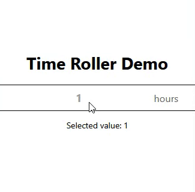

# TimeRoller

A React component for selecting a value from a range using a scrollable list. Ideal for time or value selection interfaces.

## Table of Contents

- [Installation](#installation)
- [Props](#props)
- [Example](#example)
- [Contributing](#contributing)
- [License](#license)

## Installation

To install the `react-timeroller` package, use npm or yarn:

```bash
npm install react-timeroller
```

## Props

### `range` (required)
- Type: `Array<number | string>`
- Description: An array of values that the roller can select from.

### `unit` (required)
- Type: `string`
- Description: A string representing the unit of the values (e.g., "hours", "minutes").

### `selectedValue` (required)
- Type: `number | string`
- Description: The currently selected value.

### `setSelectedValue` (required)
- Type: `function`
- Description: A function to update the selected value.

## Example

Here is a complete example of how to use the `TimeRoller` component:

```jsx
import React, { useState } from 'react';
import TimeRoller from 'react-timeroller';

function App() {
  const [selectedValue, setSelectedValue] = useState(2);
  const range = [1, 2, 3, 4, 5];

  return (
    <div className="App">
      <h1>Time Roller Demo</h1>
      <TimeRoller
        range={range}
        unit="hours"
        selectedValue={selectedValue}
        setSelectedValue={setSelectedValue}
      />
      <p>Selected value: {selectedValue}</p>
    </div>
  );
}

export default App;
```



## Contributing

Contributions are welcome! Please open an issue or submit a pull request for any bugs or improvements.

## License

This project is licensed under the MIT License.
